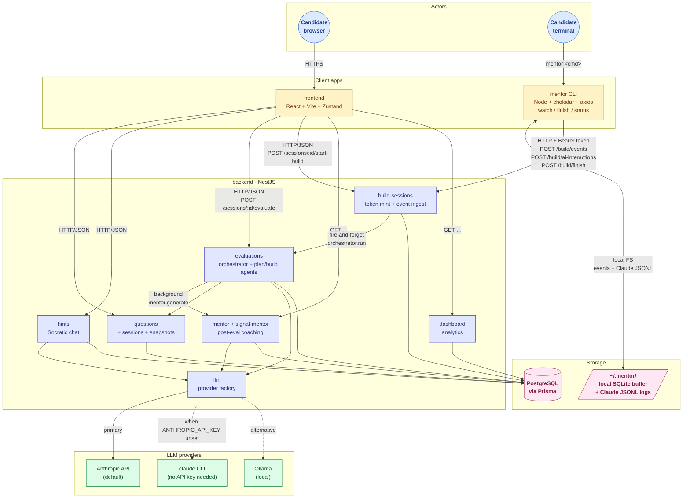
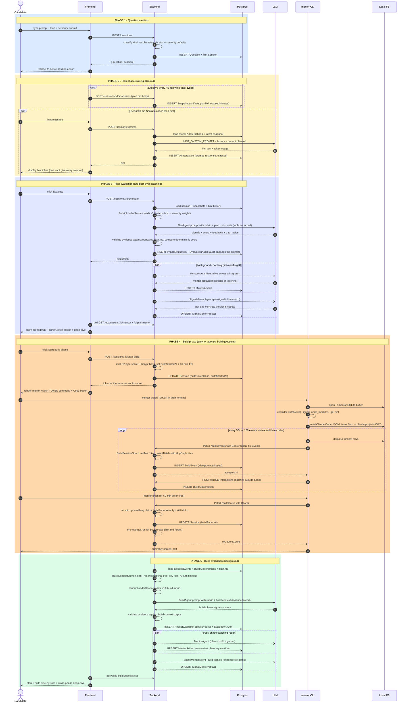

# System architecture

## Component map

```mermaid
flowchart TB

  %% ---- Actors ----
  subgraph actors[Actors]
    direction LR
    User((Candidate<br/>browser))
    Engineer((Candidate<br/>terminal))
  end

  %% ---- Frontend + CLI ----
  subgraph clients[Client apps]
    direction LR
    Frontend["frontend<br/>React + Vite + Zustand"]
    CLI["mentor CLI<br/>Node + chokidar + axios<br/>watch / finish / status"]
  end

  %% ---- Backend modules (Nest) ----
  subgraph backend[backend - NestJS]
    direction TB
    Questions["questions<br/>+ sessions + snapshots"]
    BuildSessions["build-sessions<br/>token mint + event ingest"]
    Hints["hints<br/>Socratic chat"]
    Evaluations["evaluations<br/>orchestrator + plan/build agents"]
    Mentor["mentor + signal-mentor<br/>post-eval coaching"]
    Dashboard["dashboard<br/>analytics"]
    LlmLayer["llm<br/>provider factory"]
  end

  %% ---- Storage + LLM ----
  subgraph storage[Storage]
    DB[("PostgreSQL<br/>via Prisma")]
    Files[/"~/.mentor/<br/>local SQLite buffer<br/>+ Claude JSONL logs"/]
  end
  subgraph llm[LLM providers]
    Anthropic["Anthropic API<br/>(default)"]
    ClaudeCLI["claude CLI<br/>(no API key needed)"]
    Ollama["Ollama<br/>(local)"]
  end

  %% ---- User flows ----
  User -->|HTTPS| Frontend
  Engineer -->|mentor &lt;cmd&gt;| CLI

  Frontend -->|HTTP/JSON| Questions
  Frontend -->|HTTP/JSON| Hints
  Frontend -->|HTTP/JSON<br/>POST /sessions/:id/evaluate| Evaluations
  Frontend -->|HTTP/JSON<br/>POST /sessions/:id/start-build| BuildSessions
  Frontend -->|GET ...| Mentor
  Frontend -->|GET ...| Dashboard

  CLI <-->|local FS<br/>events + Claude JSONL| Files
  CLI -->|HTTP + Bearer token<br/>POST /build/events<br/>POST /build/ai-interactions<br/>POST /build/finish| BuildSessions

  %% ---- Internal control flow ----
  BuildSessions -->|fire-and-forget<br/>orchestrator.run| Evaluations
  Evaluations -->|background<br/>mentor.generate| Mentor
  Evaluations --> Questions
  Hints --> LlmLayer
  Evaluations --> LlmLayer
  Mentor --> LlmLayer

  %% ---- Storage edges ----
  Questions --> DB
  BuildSessions --> DB
  Hints --> DB
  Evaluations --> DB
  Mentor --> DB
  Dashboard --> DB

  %% ---- LLM provider fan-out ----
  LlmLayer -->|primary| Anthropic
  LlmLayer -.->|when ANTHROPIC_API_KEY unset| ClaudeCLI
  LlmLayer -.->|alternative| Ollama

  %% ---- Styling ----
  classDef actor fill:#dbeafe,stroke:#1d4ed8,color:#1e3a8a,font-weight:bold;
  classDef client fill:#fef3c7,stroke:#b45309,color:#78350f;
  classDef backendBox fill:#e0e7ff,stroke:#4338ca,color:#312e81;
  classDef store fill:#fce7f3,stroke:#9d174d,color:#831843,font-weight:bold;
  classDef llmBox fill:#dcfce7,stroke:#15803d,color:#14532d;

  class User,Engineer actor;
  class Frontend,CLI client;
  class Questions,BuildSessions,Hints,Evaluations,Mentor,Dashboard,LlmLayer backendBox;
  class DB,Files store;
  class Anthropic,ClaudeCLI,Ollama llmBox;
```

## Candidate lifecycle

```mermaid
sequenceDiagram
  autonumber
  actor U as Candidate
  participant FE as Frontend
  participant BE as Backend
  participant DB as Postgres
  participant LLM as LLM
  participant CLI as mentor CLI
  participant FS as Local FS

  rect rgb(219, 234, 254)
    Note over U,DB: PHASE 1 - Question creation
    U->>FE: type prompt + kind + seniority, submit
    FE->>BE: POST /questions
    BE->>BE: classify kind, resolve rubricVersion + seniority defaults
    BE->>DB: INSERT Question + first Session
    BE-->>FE: { question, session }
    FE-->>U: redirect to active session editor
  end

  rect rgb(254, 243, 199)
    Note over U,DB: PHASE 2 - Plan phase (writing plan.md)
    loop autosave every ~5 min while user types
      FE->>BE: POST /sessions/:id/snapshots (plan.md body)
      BE->>DB: INSERT Snapshot (artifacts.planMd, elapsedMinutes)
    end
    opt user asks the Socratic coach for a hint
      U->>FE: hint message
      FE->>BE: POST /sessions/:id/hints
      BE->>DB: load recent AIInteractions + latest snapshot
      BE->>LLM: HINT_SYSTEM_PROMPT + history + current plan.md
      LLM-->>BE: hint text + token usage
      BE->>DB: INSERT AIInteraction (prompt, response, elapsed)
      BE-->>FE: hint
      FE-->>U: display hint inline (does not give away solution)
    end
  end

  rect rgb(224, 231, 255)
    Note over U,DB: PHASE 3 - Plan evaluation (and post-eval coaching)
    U->>FE: click Evaluate
    FE->>BE: POST /sessions/:id/evaluate
    BE->>DB: load session + snapshots + hint history
    BE->>BE: RubricLoaderService loads v3.0 plan rubric + seniority weights
    BE->>LLM: PlanAgent prompt with rubric + plan.md + hints (tool-use forced)
    LLM-->>BE: signals + score + feedback + gap_topics
    BE->>BE: validate evidence against truncated plan.md, compute deterministic score
    BE->>DB: INSERT PhaseEvaluation + EvaluationAudit (audit captures the prompt)
    BE-->>FE: evaluation
    par background coaching (fire-and-forget)
      BE--)LLM: MentorAgent (deep-dive across all signals)
      LLM-->>BE: mentor artifact (8 sections of teaching)
      BE--)DB: UPSERT MentorArtifact
    and
      BE--)LLM: SignalMentorAgent (per-signal inline coach)
      LLM-->>BE: per-gap concrete-version snippets
      BE--)DB: UPSERT SignalMentorArtifact
    end
    FE->>BE: poll GET /evaluations/:id/mentor + /signal-mentor
    FE-->>U: score breakdown + inline Coach blocks + deep-dive
  end

  rect rgb(254, 215, 170)
    Note over U,FS: PHASE 4 - Build phase (only for agentic_build questions)
    U->>FE: click Start build phase
    FE->>BE: POST /sessions/:id/start-build
    BE->>BE: mint 32-byte secret + bcrypt hash, set buildStartedAt + 60-min TTL
    BE->>DB: UPDATE Session (buildTokenHash, buildStartedAt)
    BE-->>FE: token of the form sessionId.secret
    FE-->>U: render mentor-watch-TOKEN command + Copy button
    U->>CLI: mentor watch TOKEN in their terminal
    CLI->>FS: open ~/.mentor SQLite buffer
    CLI->>CLI: chokidar.watch(cwd) - ignore node_modules, .git, dist
    CLI->>FS: read Claude Code JSONL turns from ~/.claude/projects/CWD

    loop every 30s or 100 events while candidate codes
      CLI->>FS: dequeue unsent rows
      CLI->>BE: POST /build/events with Bearer token, file events
      BE->>BE: BuildSessionGuard verifies token, insertBatch with skipDuplicates
      BE->>DB: INSERT BuildEvent (idempotency-keyed)
      BE-->>CLI: accepted N
      CLI->>BE: POST /build/ai-interactions (batched Claude turns)
      BE->>DB: INSERT BuildAIInteraction
    end

    U->>CLI: mentor finish (or 60-min timer fires)
    CLI->>BE: POST /build/finish with Bearer
    BE->>BE: atomic updateMany claims buildEndedAt only if still NULL
    BE->>DB: UPDATE Session (buildEndedAt)
    BE--)BE: orchestrator.run for build phase (fire-and-forget)
    BE-->>CLI: ok, eventCount
    CLI-->>U: summary printed, exit
  end

  rect rgb(220, 252, 231)
    Note over BE,LLM: PHASE 5 - Build evaluation (background)
    BE->>DB: load all BuildEvents + BuildAIInteractions + plan.md
    BE->>BE: BuildContextService.load - reconstruct final tree, key files, AI turn timeline
    BE->>BE: RubricLoaderService loads v3.0 build rubric
    BE->>LLM: BuildAgent prompt with rubric + build context (tool-use forced)
    LLM-->>BE: build-phase signals + score
    BE->>BE: validate evidence against build context corpus
    BE->>DB: INSERT PhaseEvaluation (phase=build) + EvaluationAudit
    par cross-phase coaching regen
      BE--)LLM: MentorAgent (plan + build together)
      BE--)DB: UPSERT MentorArtifact (overwrites plan-only version)
    and
      BE--)LLM: SignalMentorAgent (build signals reference file paths)
      BE--)DB: UPSERT SignalMentorArtifact
    end
    FE->>BE: poll while buildEndedAt set
    FE-->>U: plan + build side-by-side + cross-phase deep-dive
  end
```
