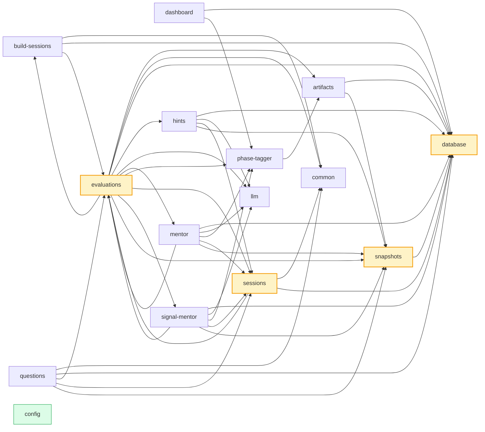

# backend — module relationships

Cross-module import graph for `backend/`. Each box is a module, each arrow is "X imports from Y". Generated from `agents/codebase-map/backend.json` (no LLM calls). See `agents/graphify/build-mermaid.py`.

**15 modules · 44 cross-module edges**
**Hubs (>= 5 inbound):** `evaluations`, `sessions`, `snapshots`, `database`
**Leaves (no inbound):** `config`

## Dependencies (text form)

| Module | Depends on | Depended on by |
|---|---|---|
| **`artifacts`** | `database`, `snapshots` | `_root`, `evaluations`, `phase-tagger` |
| **`build-sessions`** | `database`, `evaluations`, `common` | `_root`, `evaluations` |
| **`common`** | _none_ | `_root`, `build-sessions`, `evaluations`, `questions`, `sessions` |
| **`config`** | _none_ | _none_ |
| **`dashboard`** | `database`, `phase-tagger` | `_root` |
| **`database`** | _none_ | `_root`, `artifacts`, `build-sessions`, `dashboard`, `evaluations`, `hints`, `mentor`, `questions`, `scripts`, `sessions`, `signal-mentor`, `snapshots` |
| **`evaluations`** | `phase-tagger`, `llm`, `build-sessions`, `sessions`, `artifacts`, `hints`, `mentor`, `signal-mentor`, `snapshots`, `common`, `database` | `_root`, `build-sessions`, `eval-harness`, `mentor`, `questions`, `sessions`, `signal-mentor` |
| **`hints`** | `llm`, `sessions`, `snapshots`, `database` | `_root`, `evaluations` |
| **`llm`** | _none_ | `_root`, `eval-harness`, `evaluations`, `hints`, `mentor`, `signal-mentor` |
| **`mentor`** | `evaluations`, `llm`, `phase-tagger`, `sessions`, `snapshots`, `database` | `_root`, `eval-harness`, `evaluations` |
| **`phase-tagger`** | `artifacts` | `_root`, `dashboard`, `eval-harness`, `evaluations`, `mentor`, `signal-mentor` |
| **`questions`** | `sessions`, `evaluations`, `snapshots`, `common`, `database` | `_root` |
| **`sessions`** | `evaluations`, `common`, `database` | `_root`, `evaluations`, `hints`, `mentor`, `questions`, `signal-mentor` |
| **`signal-mentor`** | `evaluations`, `llm`, `phase-tagger`, `sessions`, `snapshots`, `database` | `_root`, `eval-harness`, `evaluations` |
| **`snapshots`** | `database` | `_root`, `artifacts`, `evaluations`, `hints`, `mentor`, `questions`, `signal-mentor` |
