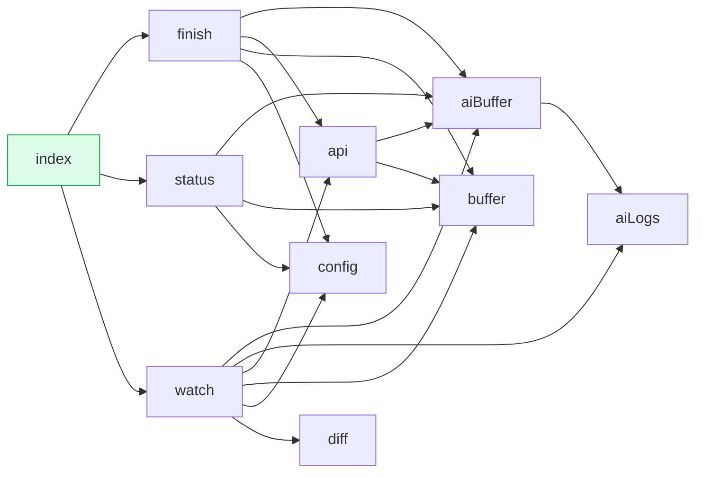

# cli — module relationships

Cross-module import graph for `cli/`. Each box is a module, each arrow is "X imports from Y". Generated from `agents/codebase-map/cli.json` (no LLM calls). See `agents/graphify/build-mermaid.py`.

**10 modules · 19 cross-module edges**
**Leaves (no inbound):** `index`

## Dependencies (text form)

| Module | Depends on | Depended on by |
|---|---|---|
| **`aiBuffer`** | `aiLogs` | `api`, `finish`, `status`, `watch` |
| **`aiLogs`** | _none_ | `aiBuffer`, `watch` |
| **`api`** | `aiBuffer`, `buffer` | `finish`, `watch` |
| **`buffer`** | _none_ | `api`, `finish`, `status`, `watch` |
| **`config`** | _none_ | `finish`, `status`, `watch` |
| **`diff`** | _none_ | `watch` |
| **`finish`** | `aiBuffer`, `api`, `buffer`, `config` | `index` |
| **`index`** | `finish`, `status`, `watch` | _none_ |
| **`status`** | `aiBuffer`, `buffer`, `config` | `index` |
| **`watch`** | `aiBuffer`, `aiLogs`, `api`, `buffer`, `config`, `diff` | `index` |
