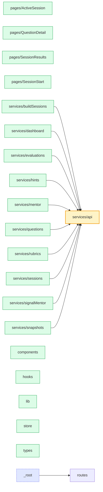

# frontend — module relationships

Cross-module import graph for `frontend/`. Each box is a module, each arrow is "X imports from Y". Generated from `agents/codebase-map/frontend.json` (no LLM calls). See `agents/graphify/build-mermaid.py`.

**22 modules · 11 cross-module edges**
**Hubs (>= 5 inbound):** `services/api`
**Leaves (no inbound):** `pages/ActiveSession`, `pages/QuestionDetail`, `pages/SessionResults`, `pages/SessionStart`, `services/buildSessions`, `services/dashboard`, `services/evaluations`, `services/hints`, `services/mentor`, `services/questions`, `services/rubrics`, `services/sessions`, `services/signalMentor`, `services/snapshots`, `components`, `hooks`, `lib`, `store`, `types`

## Dependencies (text form)

| Module | Depends on | Depended on by |
|---|---|---|
| **`_root`** | `routes` | _none_ |
| **`components`** | _none_ | _none_ |
| **`hooks`** | _none_ | _none_ |
| **`lib`** | _none_ | _none_ |
| **`pages/ActiveSession`** | _none_ | _none_ |
| **`pages/QuestionDetail`** | _none_ | _none_ |
| **`pages/SessionResults`** | _none_ | _none_ |
| **`pages/SessionStart`** | _none_ | _none_ |
| **`routes`** | _none_ | `_root` |
| **`services/api`** | _none_ | `services/buildSessions`, `services/dashboard`, `services/evaluations`, `services/hints`, `services/mentor`, `services/questions`, `services/rubrics`, `services/sessions`, `services/signalMentor`, `services/snapshots` |
| **`services/buildSessions`** | `services/api` | _none_ |
| **`services/dashboard`** | `services/api` | _none_ |
| **`services/evaluations`** | `services/api` | _none_ |
| **`services/hints`** | `services/api` | _none_ |
| **`services/mentor`** | `services/api` | _none_ |
| **`services/questions`** | `services/api` | _none_ |
| **`services/rubrics`** | `services/api` | _none_ |
| **`services/sessions`** | `services/api` | _none_ |
| **`services/signalMentor`** | `services/api` | _none_ |
| **`services/snapshots`** | `services/api` | _none_ |
| **`store`** | _none_ | _none_ |
| **`types`** | _none_ | _none_ |
