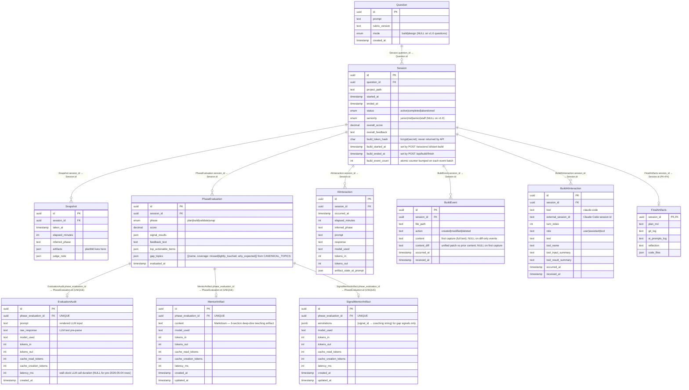

# Schema relationship diagram

Reference for the data model defined in `schema.prisma`. Update this file
when adding/removing tables or changing cardinalities. The diagram below
is the rendered SVG export of the Mermaid source that follows it — keep
the two in sync when you edit the schema.

## ER diagram

Mermaid source (click to expand)

## Relationships

Each row reads "child.foreign_key → parent.primary_key" — that's the column
linkage Postgres uses to enforce the relationship.

| Edge | Cardinality | Join (child FK → parent PK) | onDelete | Why |
| --- | --- | --- | --- | --- |
| Question → Session | 1 : N | `sessions.question_id` → `questions.id` | `Restrict` | Deleting a question goes through `QuestionsService.deleteQuestion` which `deleteMany`'s the child sessions first (in a single transaction) and then deletes the question — Restrict prevents accidental orphaning if the service is bypassed. |
| Session → Snapshot | 1 : N | `snapshots.session_id` → `sessions.id` | `Cascade` | Snapshots are session-scoped logs. |
| Session → PhaseEvaluation | 1 : N | `phase_evaluations.session_id` → `sessions.id` | `Cascade` | Re-evaluate creates a new row; history retained per session. |
| Session → AIInteraction | 1 : N | `ai_interactions.session_id` → `sessions.id` | `Cascade` | Hint chat log. |
| Session → BuildEvent | 1 : N | `build_events.session_id` → `sessions.id` | `Cascade` | File save events captured by the CLI watcher during the build phase. Each save is a row; `(session_id, occurred_at)` is indexed for the build evaluator's timeline scan. |
| Session → BuildAIInteraction | 1 : N | `build_ai_interactions.session_id` → `sessions.id` | `Cascade` | Per-turn rows from Claude Code conversation logs the CLI tails out of `~/.claude/projects/<encodedCwd>/`. Composite unique `(session_id, external_session_id, turn_index)` lets the CLI re-ship a batch idempotently. |
| Session → FinalArtifacts | 1 : 0..1 | `final_artifacts.session_id` → `sessions.id` (also PK on the child, which enforces 0..1) | `Cascade` | Optional snapshot of the session's final output (one per session). |
| PhaseEvaluation → EvaluationAudit | 1 : 0..1 | `evaluation_audits.phase_evaluation_id` → `phase_evaluations.id` (UNIQUE on child, which enforces 0..1) | `Cascade` | One audit per evaluation. Deleting an evaluation drops its audit. |
| PhaseEvaluation → MentorArtifact | 1 : 0..1 | `mentor_artifacts.phase_evaluation_id` → `phase_evaluations.id` (UNIQUE on child) | `Cascade` | Optional 6-section mentor reflection per evaluation. Phase-aware (Phase 5): fires for plan and build evals. |
| PhaseEvaluation → SignalMentorArtifact | 1 : 0..1 | `signal_mentor_artifacts.phase_evaluation_id` → `phase_evaluations.id` (UNIQUE on child) | `Cascade` | Optional per-signal coaching map — `{signal_id → annotation}` populated only for gap signals (missed-good, fired-bad). Loads the rubric matching the eval's actual phase. |

## Design highlights

- **Question vs Session split**: Question = the problem
  (prompt + rubric version), Session = one attempt. A Question owns N
  attempts; the most recent `plan.md` is copied forward into a new attempt
  via the "Try again" path.
- **EvaluationAudit is a sibling, not a parent**, of `PhaseEvaluation`:
  parsed output (score, signals, feedback) stays lean on the main table;
  the heavy prompt/raw-response text lives only in the audit table. Cascade
  keeps them aligned without bloating the hot path.
- **No upsert on PhaseEvaluation.** Each Re-evaluate inserts a new row.
  The `(session_id, phase, evaluated_at DESC)` index makes "latest plan
  eval for session X" a single seek; nothing is ever overwritten.
- **JSON columns vs relational rows.** `signal_results`, `artifacts`,
  and `gap_topics` are JSON because their shape is rubric-driven /
  vocabulary-driven and varies across versions. Anything queried
  directly (status, scores, foreign keys) is a typed column.
- **Build phase capture is per-row.** A CLI watcher (`mentor watch`)
  ships file saves to `POST /api/build/events` and Claude Code
  conversation turns to `POST /api/build/ai-interactions`. Each save
  is one `BuildEvent`; each turn is one `BuildAIInteraction`. The
  build evaluator reconstructs the final tree from the event log
  (`reconstructBuildTree` applies `created` / `modified` / `deleted`
  in order, falling back gracefully on broken patches), then trims
  to a prompt-shaped slice via `selectBuildContext` (top-N
  highest-churn snippets, recent K AI turns).
- **Token-scoped auth on build endpoints.** `Session.build_token_hash`
  stores `bcrypt(secret)` for the per-session bearer token minted by
  `POST /sessions/:id/start-build`. The token format is
  `<sessionId-uuid>.<32-byte-hex-secret>` so the guard does an O(1)
  session lookup before the bcrypt compare. The hash is stripped from
  every API read path by `SessionsRepository.stripHash`.
- **`gap_topics`** is the structured gap list per phase eval (input to
  the future study feature that will aggregate "you've missed
  caching in 3 of your last 5 sessions" across questions). Frozen
  vocabulary lives in `helpers/canonical-topics.ts`; the LLM picks
  names from there at the tool layer, validators drop out-of-list
  paraphrases with a warn.
- **No `gap_topics` index.** It's read together with the eval row,
  not queried independently — yet. When the study feature lands,
  add a GIN index on `gap_topics` jsonb_path_ops if any cross-session
  query starts scanning.
